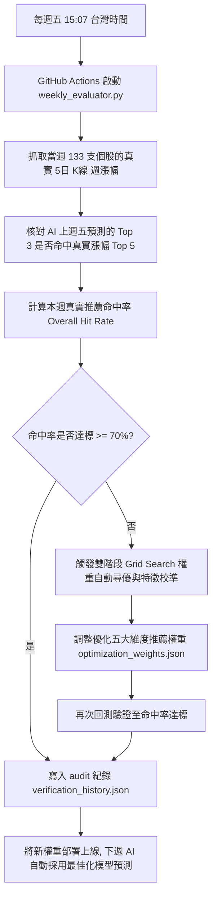

# 📈 AI 盤後股票智能分析儀表板 (AI Stock Dashboard)

一個基於 GitHub Actions + Firebase Hosting 雲端無伺服器架構 (Serverless) 的**旗艦級暗色霓虹毛玻璃 (Dark-Neon Glassmorphism) 盤後智能分析儀表板**。結合 Gemini 1.5 智算引擎與自動排程爬蟲，為交易者提供極具視覺衝擊力、專業數據精準度，以及能「自我優化進化」的個股與市場趨勢決策支援。

🌐 **線上訪問網址**：[https://my-stock-ai-dashboard.web.app/](https://my-stock-ai-dashboard.web.app/)

---

## 1. 🌟 核心網頁功能與視覺設計

本專案的前端介面採用現代化 Vanilla HTML/CSS/JS + Chart.js 打造，不使用任何臃腫的框架，展現極致的載入速度與極具科技感的暗色毛玻璃美學。

### 1.1. 頂部核心指標走勢看板 (Market Trends)
最上方設有 4 個核心指數卡片，展示近 1 個月的歷史日線收盤走勢：
1. **大盤加權指數 (`^TWII`)**：台股大盤指標。
2. **美元兌台幣匯率 (`USDTWD=X`)**：專業外匯指標，引進 **4 位小數高精度浮點格式** (如 `31.4140`)，滿足真實匯率波動細節。
3. **黃金期貨 (`GC=F`)**：避險商品指標。
4. **輕原油期貨 (`CL=F`)**：大宗原物料指標。

每張卡片右側繪製了精緻的**無人格迷你折線圖 (Sparklines)**：
- 隱藏網格、軸線與資料點，專注於平滑走勢與半透明漸層下填滿。
- **動態配色**：當日上漲自動渲染為**霓虹粉紅**，下跌自動渲染為**霓虹青綠**。

### 1.2. 互動詳細大趨勢折線圖彈窗 (Interactive Detailed Modal)
點擊頂部任何一個指標卡片，會以 Flex 彈出高質感的磨砂毛玻璃 Modal 彈窗：
- **完整數據呈現**：繪製近一個月完整的 X 軸（日期如 `04-28`）與 Y 軸（自適應價格區間）。
- **微米級霓虹格線**：圖表網格設定為微透光的 `rgba(255, 255, 255, 0.03)`，保留極佳的科技背景質感。
- **滑鼠懸浮提示 (Tooltip)**：滑鼠移入點標記時，即時浮現當日的日期與收盤報價。
- **內存防溢銷毀機制**：每次關閉或切換圖表時，皆會調用 `bigTrendChartInstance.destroy()`，徹底避免 Chart.js 實例重疊衝突與瀏覽器記憶體洩漏。

### 1.3. 板塊個股與 AI 推薦系統
支援 **7 大核心股票分類板塊**（包含半導體製造與設備、IC 設計與晶片、記憶體與 AI 儲存 / HBM、AI 伺服器與散熱、金融與航運巨頭、人氣高息 ETF、綠能與重電建設），收錄 133 支熱門指標股：
- **AI 明日之星 (Top 3 推薦卡片)**：自動挑選板塊中綜合評估最優的 3 支潛力上漲個股。
- **AI 智能決策看板**：個股點擊後，右側將即時載入由 AI 驅動的**五維技術雷達圖**（技術走勢、公司營利、籌碼動向、新聞輿情、綜合評估），並附有公司財務分析、最新重要新聞、預測依據與 AI 推薦指數 (評分 1.0~10.0)。

---

## 2. 📅 自動週五檢測與 AI 自我進化機制 (Weekly Self-Evolution)

本系統的核心技術優勢在於**具備封閉的反饋修正循環**。AI 不只給出預測，每週五收盤後，系統還會自動執行「總驗收與進化優化」！



### 2.1. 檢測指標與命中定義
每週五下午 15:07 台灣時間，背景任務會啟動 `weekly_evaluator.py`：
- **命中定義**：系統核對上週五 AI 所預測出的各板塊「**明日/一週之星 Top 3**」，是否成功列入該板塊當週實際漲幅的「**前 5 名 (Top 5)**」。
- **整體命中率 (Overall Hit Rate)**：
  $$\text{整體命中率} = \frac{\text{所有板塊命中總支數}}{\text{總推薦個股數 (7 板塊 } \times 3 \text{ 支} = 21 \text{ 支)}} \times 100\%$$

### 2.2. 五大維度超參數權重自我優化
若整體命中率未達 **70%** 目標，系統會自動在雲端進行推薦公式的超參數 Grid Search 尋優，調整以下 5 大維度的加權比重：
1. **技術走勢 (`technical`)**
2. **公司營利 (`financial`)**
3. **籌碼動向 (`institutional`)**
4. **新聞輿情 (`news_sentiment`)**
5. **量能動態 (`volume_momentum`)**

最優化的權重組合將被寫入 `optimization_weights.json`。下週一開盤時，AI 便會**自動套用進化後的最佳模型權重**進行個股評分與推薦，達成完全自動化的機器學習閉環 (AutoML Loop)。

所有歷史的驗收紀錄、各板塊實際漲幅名單、命中支數等，都會被完整保存在 `verification_history.json` 中作為審計日誌。

---

## 3. ⚙️ 自動化排程架構 (CI/CD Workflow)

整個系統的自動更新完全依靠 GitHub Actions 的排程工作流 (`.github/workflows/daily_stock.yml`)，每週一至週五下午自動化執行：

- **時間設定**：台灣時間下午 15:07 自動觸發 (`cron: '7 7 * * 1-5'`)。
- **自動化工作流步驟**：
  1. **Checkout 程式碼**：拉取最新的專案代碼。
  2. **環境初始化**：設定 Python 3.11 環境並安裝 `requirements.txt` 中的依賴。
  3. **資料更新與分析 (`data_exporter.py`)**：
     - 利用異步 ThreadPool 技術並行下載 133 支個股最新當日即時收盤報價。
     - 抓取 TAIEX、美元兌台幣、黃金、原油近一個月日線趨勢數據。
     - 產出 `stock_cache.json`、`market_trends.json`、`meta.json` 及 `categories.json`。
  4. **週五自我進化 (僅限週五)**：執行每週總驗收，優化並更新 `optimization_weights.json`。
  5. **寫回儲存庫**：將更新後的行情與權重 JSON 數據檔案以 `git config` 自動提交 (Commit & Push) 回 GitHub。
  6. **雲端發布部署**：在安裝 Firebase-tools 後，帶入密鑰 `FIREBASE_TOKEN` 將最新的網頁與資料庫一併發布至 Firebase Hosting 靜態伺服器！

---

## 4. 📂 專案檔案結構簡介

```
├── .github/workflows/
│   └── daily_stock.yml           # GitHub Actions 每日自動排程 CI/CD 設定檔
├── static/                       # 前端靜態資源目錄 (Firebase Hosting 公開資料夾)
│   ├── data/                     # Actions 輸出與前端讀取的實時 JSON 資料夾
│   │   ├── categories.json       # 股票分類板塊對照表
│   │   ├── market_trends.json    # 大盤/美金/黃金/原油一個月歷史走勢
│   │   ├── meta.json             # 儀表板最後更新時間等元數據
│   │   ├── optimization_weights.json  # 自我進化優化後的五大推薦權重
│   │   ├── stock_cache.json      # 133 支股票的即時報價與 AI 財務新聞雷達分析
│   │   └── verification_history.json  # 歷史週五驗收命中率與進化審計日誌
│   ├── index.html                # 高端暗色霓虹毛玻璃 UI (含彈窗 DOM)
│   ├── style.css                 # 響應式 CSS 樣式表 (含大折線圖與彈窗排版)
│   └── app.js                    # 前端核心渲染、Click 監聽與 Chart.js 大圖實作
├── data_exporter.py              # Actions 執行入口：負責個股更新、指數抓取與 JSON 複製
├── stock_agent.py                # 股票評分、異步 quote 下載與快取讀寫邏輯
├── weekly_evaluator.py           # 每週五驗收評分與 Grid Search 權重自我進化核心引擎
├── firebase.json                 # Firebase 部署控制與快取控制 Cache-Control headers 設定檔
└── requirements.txt              # Python 第三方庫依賴定義檔
```
